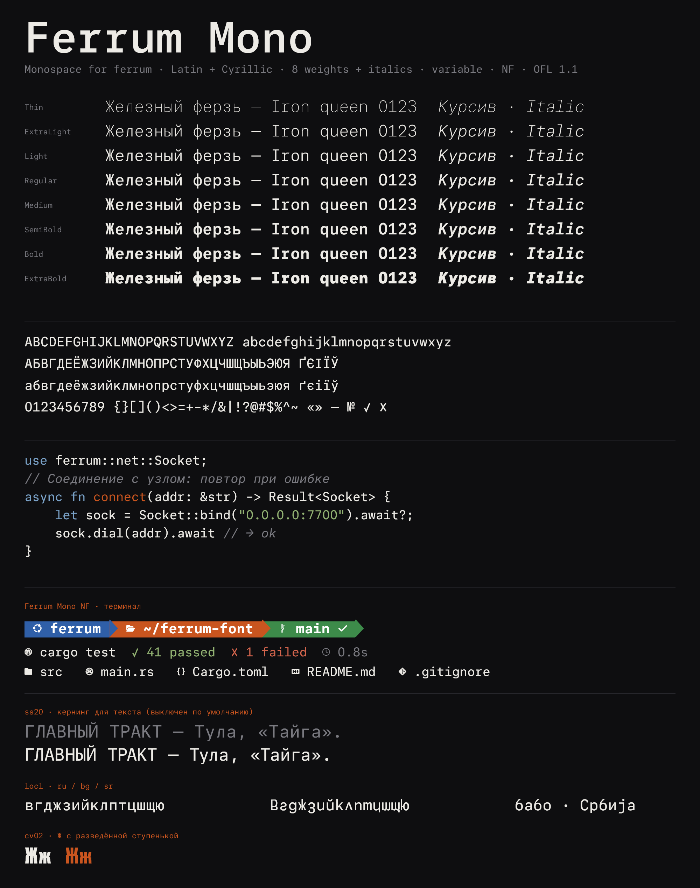
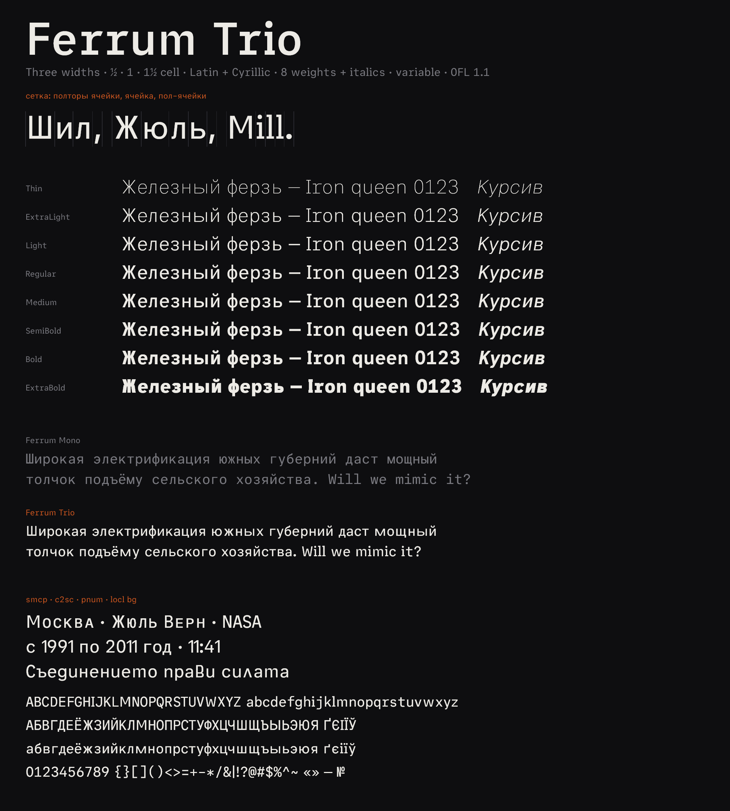

# Ferrum fonts

Typefaces of the ferrum project. Every family lives in its own folder with
its fonts, webfonts, build scripts, changelog and specimen.

| Family | Folder | Scripts | Styles | Version |
|---|---|---|---|---|
| **Ferrum Mono**: monospace for code, terminals and UI | [`ferrum-mono/`](ferrum-mono/) | Latin, Cyrillic (+ Bulgarian, Serbian, Macedonian forms) | Thin–ExtraBold + italics, variable, NF | 1.005 |
| **Ferrum Trio**: Ferrum Mono on three widths (½, 1, 1½ cell) for text and headings | [`ferrum-trio/`](ferrum-trio/) | Latin, Cyrillic (+ Bulgarian, Serbian, Macedonian forms) | Thin–ExtraBold + italics, variable | 1.004 |
| **Ferrum Mono Experimental**: Ferrum Mono with diagonal tops on l/r and stronger pen contrast | [`ferrum-experimental/`](ferrum-experimental/) | same as Ferrum Mono | Thin–ExtraBold + italics, NF | 1.005 |






## Use

Each family has `fonts/ttf/` to install on a computer (uprights and italics),
`fonts/webfonts/` with WOFF2 files and a ready `@font-face` stylesheet (also
split by script in `subset/`), and `fonts/variable/` with one variable font per
style (weight 100–800). See the family README,
e.g. [Ferrum Mono](ferrum-mono/README.md) or [Ferrum Trio](ferrum-trio/README.md).

## Layout

```
OFL.txt                 one license for every family
ferrum-mono/
  README.md             usage, features
  FONTLOG.md            changes per version
  specimen.png
  fonts/ttf/            desktop fonts
  fonts/webfonts/       WOFF2 + ferrum-mono.css; subset/ split by script
  fonts/variable/       FerrumMono[wght], FerrumMono-Italic[wght] + CSS
  fonts/nerd/           Ferrum Mono NF: with Nerd Fonts icons, for terminals
  scripts/              build pipeline (scripts/README.md)
ferrum-trio/            same shape; built from ferrum-mono's fonts
ferrum-experimental/    processed build of ferrum-mono (arch + contrast)
  fonts/ttf/            desktop fonts, arch + contrast applied
  fonts/nerd/           NF variants
  specimen.png
```

`build.sh` builds every family from the sources, in order.

A new family gets a folder of the same shape (`ferrum-<name>/`), a row in the
table above and its copyright lines in `OFL.txt`.

## License

SIL Open Font License 1.1, see [OFL.txt](OFL.txt). You can use, modify and
redistribute the fonts, including in commercial products; the fonts themselves
may not be sold on their own, and modified versions must stay under the OFL.

Ferrum Mono and Ferrum Trio are based on Paper Mono (Lost Coast Labs, Inc.)
with Cyrillic from Geist Mono (Vercel) and are not affiliated with or endorsed
by either.
