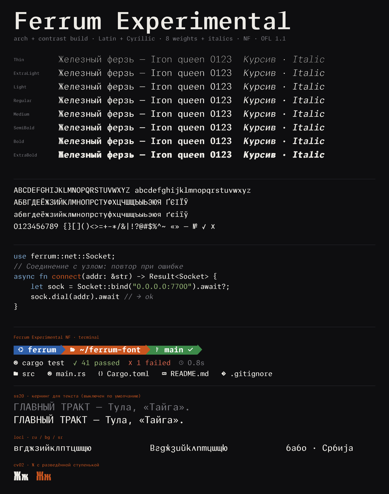

# Ferrum Experimental

Ferrum Mono with two post-processing stages applied on top of the standard
build. Everything else — metrics, features, glyph set, cell width — is
identical to Ferrum Mono.



## What's different

**Diagonal tops** (`arch.py`): lowercase **l** and **r** get a curved diagonal
top instead of a flat horizontal shelf. On **l** the ascender sweeps to a
concave arc; on **r** the arm tapers to a pointed diagonal at the shoulder.
No points added or removed — variable masters stay compatible.

**Stronger pen contrast** (`contrast.py`): the humanist 30° axis is pushed
further. Verticals gain more weight (VERT 0.024 vs 0.016), horizontals are
thinner (HORZ 0.090 vs 0.048). The curvature-jump target is raised to
CALM 0.26 (was 0.18), which widens the bottom arches of round letters
(о е р б ц etc.) — they no longer pinch at ExtraBold.

## Use

Install from `fonts/ttf/` (uprights + italics) or use the NF variants in
`fonts/nerd/` for terminals with Nerd Fonts icons.

No webfonts or variable font in this folder — use Ferrum Mono's `fonts/`
for those; the variable masters aren't rebuilt here.

## Rebuild

```sh
python -I ferrum-mono/scripts/arch.py     <path/to/FerrumMono-*.ttf>
python -I ferrum-mono/scripts/contrast.py <path/to/FerrumMono-*.ttf>
# VERT=0.024  HORZ=0.090  CALM=0.26  FAIR=6000  ENERGY=0.02
```

Or run `build_experimental.py` from the repo root.
